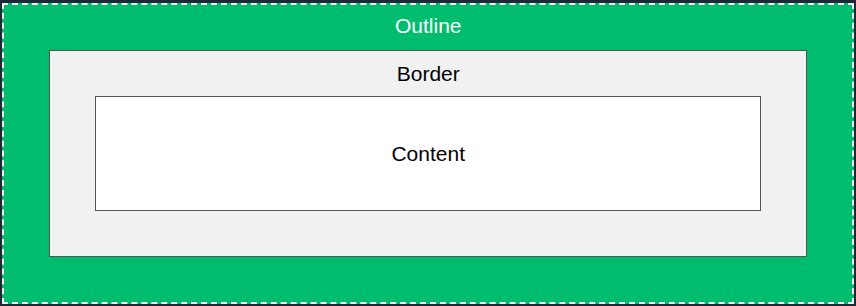

# ANOTAÇÕES CSS

# <p id="sumario">SUMÁRIO</p>

<a href="#css-basico" style="font-weight: bold">PARTE 1: CSS Básico</a>

- <a href="#seletores">Seletores</a>
- <a href="#esboço">Esboço CSS</a>
- <a href="#texto">Texto CSS</a>

---

# <p id="css-basico">PARTE 1: CSS Básico</p>

## <p id="seletores">Seletores</p>

|**CATEGORIAS DE SELETORES**|
|---------------------------|

|                                 |                                                                          |
|---------------------------------|--------------------------------------------------------------------------|
| **Seletores Simples**           | Selecionam elementos com base no nome, id e classe                       |
| **Seletores Combinadores**      | Selecionam elementos com base em um relacionamento específico entre eles |
| **Seletores de PseudoClasse**   | Selecionam elementos com base em um determinado estado                   |
| **Seletores de PseudoElemetos** | Selecionam e estilizam uma parte do elemento                             |
| **Seletores de Atributos**      | Selecionam elementos com base em um atributo ou valor de atributo        |

```css
/* 
SELETOR DE ELEMENTOS
*/

p {
  text-align: center;
  color: red;
}

/*
SELETOR DE ID
*/

#selc_id {
  text-align: center;
  color: red;
}

/*
SELETOR DE CLASSE
*/

.center {
  text-align: center;
  color: red;
}

/*
SELEÇÃO ESPECÍFICA COM CLASSE
*/

p.center {
  text-align: center;
  color: red;
}

/*
SELETOR DE AGRUPAMENTO
*/
h1, h2, p {
  text-align: center;
  color: red;
}
```

## <p id="esboço">Esboço CSS</p>

Um contorno é uma linha desenhada ao redor de elementos.
- Utilizado para destacar um elemento.



|**PROPRIEDADES**|
|----------------|

|                  |                                                         |
|------------------|---------------------------------------------------------|
| `outline-style`  | especifica o estilo do contorno                         |
| `outline-color`  | especifica a cor do contorno                            |
| `outline-width`  | especifica a largura do contorno                        |
| `outline-offset` | aplica um espaço entre o contorno e a borda do elemento |
| `outline`        | forma abreviada                                         |

**`outline-style`** valores:
1. `dotted` - pontilhado.
2. `dashed` - tracejado.
3. `solid` - sólido.
4. `double` - contorno duplo.
5. `groove` - ranhurado 3d.
6. `ridge` - estriado 3d.
7. `inset` - inserção 3d.
8. `outset` - inicial 3d.
9. `none` - nenhum.
10. `hidden` - oculto.

**`outline-color`** valores:
1. name.
2. HEX.
3. RGB.
4. HSL.
5. invert - inversão de cores para garantir visibilidade do contorno.

_Nota: o contorno não faz parte das dimensões do elemento e pode se sobrepor a outros elementos._

> OBS: as demais propriedades dependem que outline-style esteja ativado para funcionar.

## <p id="texto">Texto CSS</p>

|**Alinhamento e Direção do Texto**|
|----------------------------------|

```css
/*
PROPRIEDADE "text-align": alinhamento horizontal do texto. 
*/

h1 {
  text-align: center /* left, right e justify */
}

/*
PROPRIEDADE "text-align-last: alinhamento do última linha de um texto"
*/

h1 {
  text-align-last: center /* left, right e justify */
}

/*
PROPRIEDADES "directioon" e "unicode-bidi": alteram a direção de um texto
*/

p {
  direction: rtl;
  unicode-bidi: bidi-override;
}

/*
PROPRIEDADE "vertical-align": alinhamento vertical do texto.
*/

img.a {
  vertical-align: baseline; /* text-top, text-bottom, sub e super */
}
```

|**Decoração de Texto**|
|----------------------|

```css
/*
PROPRIEDADE "text-decoration-line": linha de decoração ao texto.
*/

h1 {
  text-decoration-line: overline; /* line-through e underline */
}

/*
PROPRIEADDE "text-decoration-color": cor para linha de decoração.
*/

h1 {
  text-decoration-line: overline;
  text-decoration-color: red;
}

/*
PROPRIEDADE "text-decoration-style": estilo da linha de decoração. 
*/

h1 {
  text-decoration-line: overline;
  text-decoration-style: solid; /* double, dotted, dashed e wavy */
}

/*
PROPRIEDADE "text-decoration-thickness": espessura da linha de decoração.
*/

h1 {
  text-decoration-line: overline;
  text-decoration-thickness: 5px;
}
```

_Nota: pode-se utilizar da forma abreviada, text-decoration._

|**Espaçamento de Texto**|
|------------------------|

| | |
|-|-|
| `text-indent` | especifica o recuo da primeira linha |
| `letter-spacing` | define o espaço entre os caracteres em um texto |
| `line-height` | espaço entre as linhas |
| `word-spacing` | espaço entre as palavras de um texto |
| `white-space` | especifica como o espaço em branco dentro de um elemento é tratado |

<a href="#sumário">Retornar para sumário</a>